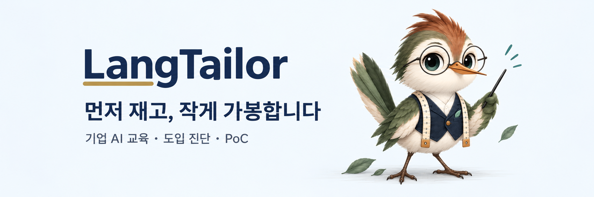

  

  

<h1 align="center">LangTailor</h1>

  <em>먼저 재고, 작게 가봉합니다.</em> 
  <strong>Measure first, baste small.</strong>

  <a href="mailto:taylor@langtailor.com">taylor@langtailor.com</a>
  ·
  <a href="https://langtailor.com" target="_blank" rel="noreferrer">langtailor.com</a>

중소기업 대상 RAG 기반 AI 도입을 현실적이고 안전하게 설계하는 1인 기업입니다. 단순한 솔루션 공급이 아니라, 사업 타당성 진단, 검증 가능한 PoC, 조직 내 역량 강화까지 연결하는 방식으로 고객의 변화를 함께 준비합니다.

## Business Model

- 📏 사내 AI 도입 타당성 진단
- 🪡 외부 유출 없는 온프레미스 RAG PoC 검증
- 👔 사내 임직원 AI 내재화 교육 (KDT / 기업 출강)

LangTailor는 현업 문제를 먼저 정확히 정의하고, 작은 실험으로 검증한 뒤, 조직이 스스로 사용할 수 있는 수준까지 설계합니다. 이를 통해 기술 도입의 부담을 줄이고, 실제 운영성과를 만들기 위한 경로를 마련합니다.

## Tech Stack

  
  
  
  
  

## Demo Projects

다음 데모 프로젝트는 준비 중이며, 공개 시점에 연결될 예정입니다.

- [Demo Project 01](#)
- [Demo Project 02](#)
- [Demo Project 03](#)

## Contact

- Email: [taylor@langtailor.com](mailto:taylor@langtailor.com)
- Website: [langtailor.com](https://langtailor.com)

---

사내 지식 기반 AI 도입을 고민하고 있다면, 문제를 정확하게 진단하고 검증 가능한 작은 단계로 시작하는 방식으로 함께 준비하겠습니다.
